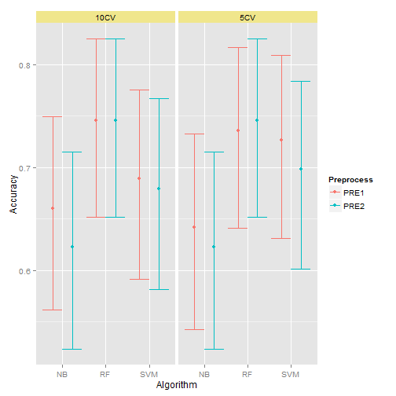
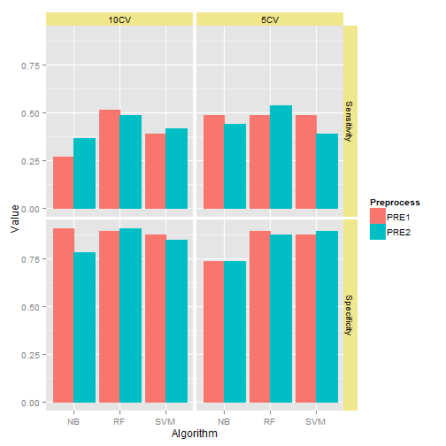
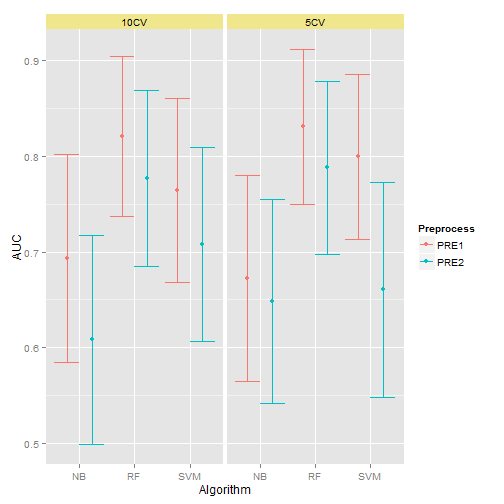

Predicting Cancer Stage Using miRNA
========================================================
author: 
date: 

Outline
========================================================

- [Background](#/background)
- [Data](#/data)
- [Methods](#/methods)
- [Results](#/results)
- [Analysis](#/analysis)

Background
========================================================
type: section
id: background

KIRC
========================================================

Kidney Renal Clear Cell Carcinoma (KIRC) is the most common
form of kidney cancer.

Data
========================================================
type: section
id: data

TCGA
========================================================

The Cancer Genome Atlas (TCGA) data portal was used to 
download data.

Methods
========================================================
type: section
id: methods

Algorithms
=======================================================

1. Support vector machine (SVM)
2. Random forest (RF)
3. Naive Bayes (NB)

Preprocessing
=======================================================

1. Filter based on intensity of expression and coefficient
of variation (subsequently labeled `PRE1`)
2. Filter based on p-value of t-test and transform using
principal compenents (subsequently labeled `PRE2`)

Splitting
=======================================================

1. 5-fold cross validation (subsequently labeled 5CV)
2. 10-fold cross validation (subsequently labeled 10CV)

Results
=======================================================
type: section
id: results

Accuracy
======================================================

 

Specificity/Sensitivity
========================================================

 

Area Under Curve
========================================================

 

Analysis
=======================================================================
type: section
id: analysis
